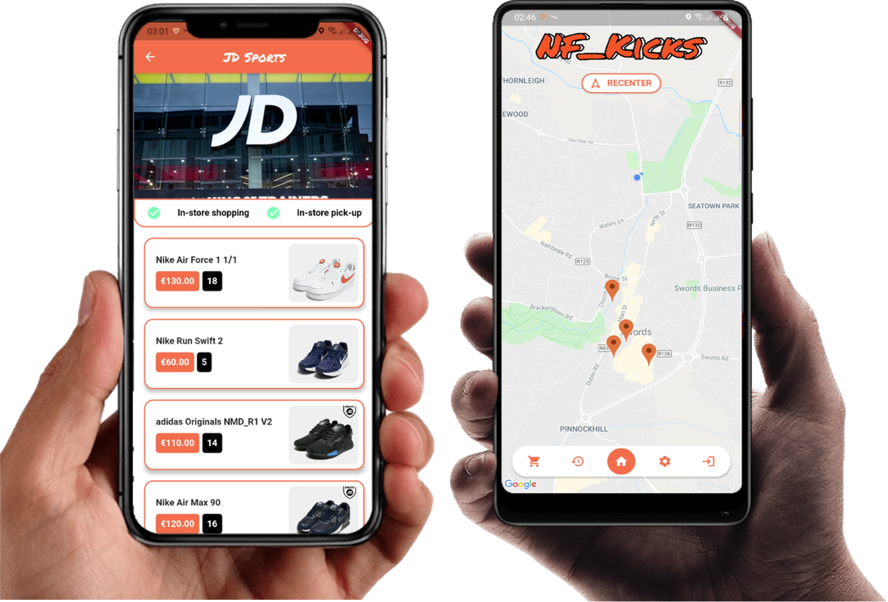

# Nf_kicks 👟

The Nf kicks application is a socially distanced e-commerce app that serves as a security assessment for modern e-commerce application security.

## Running the Project on Android 📱

Simply download the release under "NF Kicks Android" to run this project on Android.
The project requires an Android device running Android 7.0 (Nougat) or higher; devices lower this will not run the project.

## Running the Project on IOS 📱

Unfortunately, because the project is not registered with Apple, it will not run on a physical device. However, in order to run the iOS build, a Macbook running Xcode and an iOS simulator on the computer are required, run the flutter application by opening the codebase in Android Studio and choose the IOS simulator when running.

## Running the Project's Codebase 🚀

To run this project's codebase resources to get you started are located here:

- [Install Flutter Here](https://flutter.dev/docs/get-started/install)
- [Install Android Studio Here](https://developer.android.com/studio/)
- [Install Xcode Here](https://apps.apple.com/us/app/xcode/id497799835)